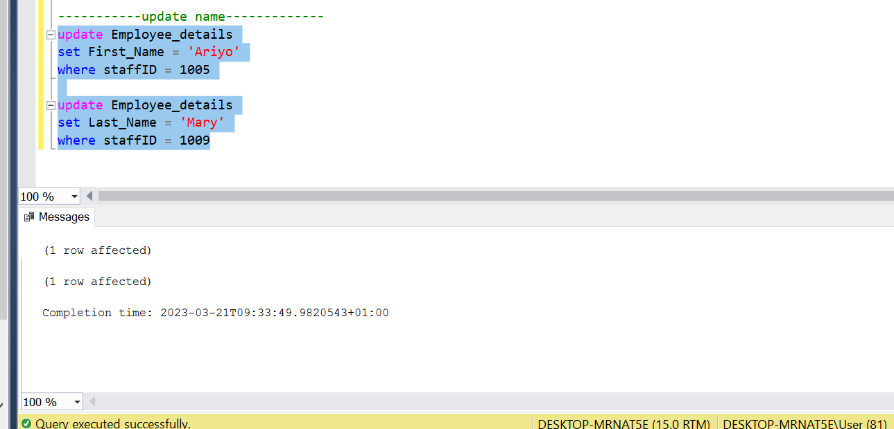
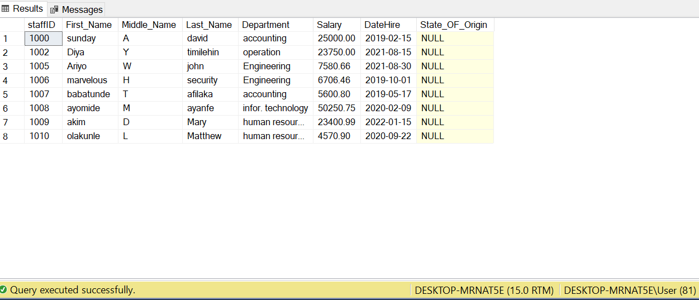

# **Jacobs-Supermart**

**Introduction:**
This is an SQL Analysis for a Supermart Store, showing the Names,Departments,Salaries,State of each workers in the Store.
Areas covered in the analysis includes DDL,DML,TCL,TQL(of course because i did a lot of **SELECTING**:see_no_evil:) You will definitely find more query languages along the line in this project:yum:

_Disclaimer_ This project is done to improve my skills and to show that to a fault,i can use all these query languages appropraitely.The names,values are imaginary.Lets jump right in :boom:

Lets create the **Database** that will house our queries

Database                                               |Result
:------------------------------------------------------|:------------------------------------------------------
                                                  |

There we have it:smiley: Make sure you select the Database you just created,so that when you create your table it automatically houses it in that Database

Now, let us create a table.The table will be hosted in our Database

Looks like our table will be empty:weary:Lets populate it

.png)

Lets select all we populated to see the Before and After magic

Before                                           |After
:-------------------------------------------------|:-----------------------------------------------------------
                                             |

Lets do some basic calculations
- average
- minimum
- count

The result:

.png)

Lets update the salary of one of the Employee:shushing_face:
Update Query                                                 | Updated
:----------------------------------------------------------|:---------------------------------------------
.png)                                             |

Lets update some of our Employee names:
Before                                                     | After
:--------------------------------------------------------|:--------------------------------------
                                               |.png)

We want to modify our table and, add another column to the existing table.

Before                                          | After
:-------------------------------------------|:-------------------------------------
                                        |

Oh Oh:unamused: Empty column again. Lets populate
