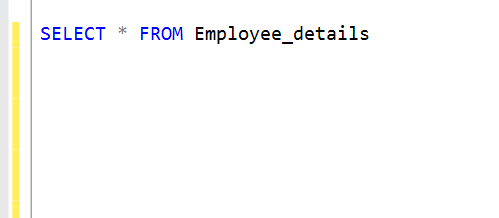

# **Jacobs-Supermart**

**Introduction:**
This is an SQL Analysis for an imaginary Supermart Store, showing the Names,Departments,Salaries,State of each workers in the Store.
Areas covered in the analysis includes DDL,DML,TCL,TQL(of course because i did a lot of **SELECTING**:see_no_evil:) You will definitely find more query languages along the line in this project:yum:

_Disclaimer_ This project is done to improve my skills and to show that to a fault,i can use all these query languages appropraitely.The names,values are imaginary.Lets jump right in :boom:

Lets create the **Database** that will house our queries

Database                                               |Result
:------------------------------------------------------|:------------------------------------------------------
                                                  |

There we have it:smiley: Make sure you select the Database you just created,so that when you create your table it automatically houses it in that Database

Now, let us create a table.The table will be hosted in our Database

Looks like our table will be empty:weary:Lets populate it

.png)

Lets select all we populated to see the Before and After magic

Before                                           |After
:-------------------------------------------------|:-----------------------------------------------------------
                                             |

Lets do some basic calculations
- average
- minimum
- count

The result:

.png)

Lets update the salary of one of the Employee:shushing_face:
Update Query                                                 | Updated
:----------------------------------------------------------|:---------------------------------------------
.png)                                             |

Lets update some of our Employee names:
Before                                                     | After
:--------------------------------------------------------|:--------------------------------------
                                               |.png)

We want to modify our table and, add another column to the existing table.

Before                                          | After
:-------------------------------------------|:-------------------------------------
                                        |

Oh Oh:unamused: Empty rows again.Lets populate

Before Population                               | After Population
:-----------------------------------------------|:------------------------------------------
.png)                                           |

Yaay!

We can **SELECT** functions, we may want to call out some columns without returning the entire table. See here:point_down:

We want to use the group by statement now

We can see the statement and Output below

Query                                   |Result
:---------------------------------------|:---------------------------------------
                                    |

We want to use the ORDER BY command to sort our query in asc order

The next on the line now is to add more values to our existing table after which,we will drop the salary column. The output is below

Populating table                           | Alter Query
:------------------------------------------|:----------------------------------
.png)                               |

The SELECT statement is used to call our table, it then returns our entire column excluding the Salary column which we already dropped

Next on the list: We want to create another table which will house our Employee_payment_details

lets populate :tired_face:

Now that it has been effected,lets view our tables together! Yes, we can view tables together using the SELECT command.see here:point_down:
Before                                     | After
:------------------------------------------|:-------------------------------------------
.png)                            |

We want to add more rows to our table,but different banks from default bank

We want to use the SELECT command along with the WHERE clause to run some Queries.
Before                                    |After
:-----------------------------------------|:------------------------------------------
                                     |

Lets use the comparison operator to run Queries in our Employee_payment_detais table.Below is a snippet of what the before and after query looks like.
Before                                  |After
:------------------------------------------|:------------------------------------------
.png)                                      |.png)

Oops! looks like our time is far spent :open_mouth: Lets look at the range operator before we conclude.

.png)

Thank you for staying tuned. In the concluding part, we will be joining our tables and creating views:yawning_face:
